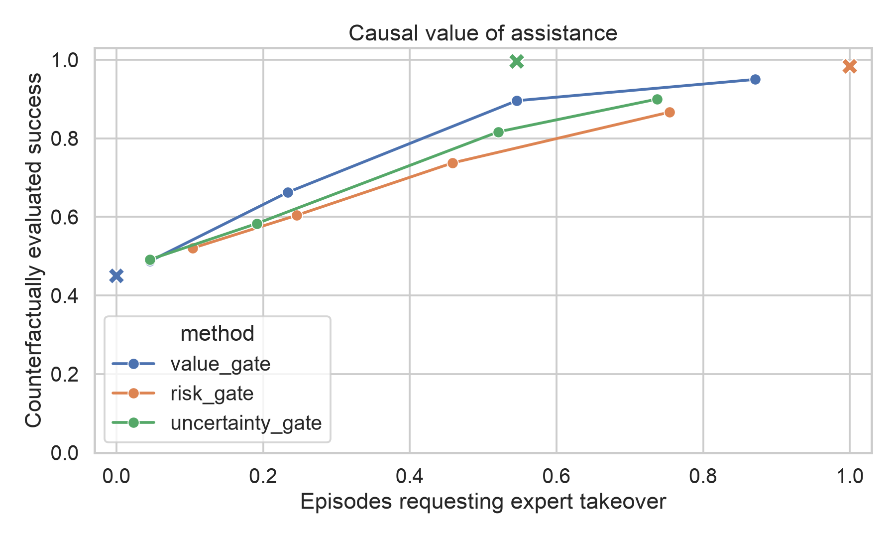
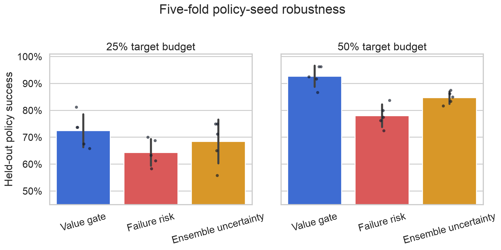
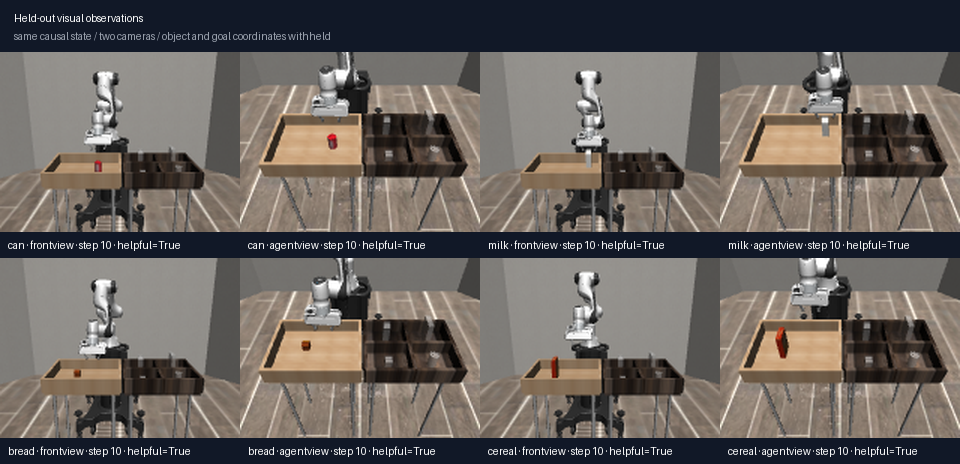

# InterveneSim-Value

[](https://github.com/ethanvillalovoz/intervenesim/actions/workflows/ci.yml)
[](https://www.python.org/)
[](LICENSE)
[](docs/reproducibility.md)

**A robot should not ask “Will I fail?” It should ask “Will help change the outcome?”**

InterveneSim-Value is a reproducible causal benchmark for learning when expert takeover is
actually useful. At fixed decision points, it snapshots the complete MuJoCo and controller
state, then evaluates two futures from that exact state: autonomous continuation and expert
takeover. The resulting label measures the value of intervention—not merely failure risk.

> **Primary held-out-policy result:** at approximately one-quarter of episodes helped, the
> value gate reaches **66.2% success with 23.3% intervention**, versus **60.4% success with
> 24.6% intervention** for a failure-risk gate. Its helpful-intervention AUROC is **0.817**
> versus **0.706** for risk.

[Read the v0.3 technical report](output/pdf/intervenesim-value-report.pdf) ·
[Explore the project page](docs/index.html) ·
[Inspect the frozen v0.3 results](results/intervenesim-value) ·
[Read the protocol](docs/intervenesim-value.md)

[](results/intervenesim-value/intervenesim-value-fork.mp4)

Both video panels start at the same saved simulator state on a held-out bread-policy
gripper-slip episode. The replay is checked against the frozen dataset before encoding:
autonomous continuation fails; expert takeover succeeds.

## The causal experiment

| Dimension | Design |
|---|---|
| Robot and simulator | Panda arm, robosuite PickPlace, MuJoCo |
| Object domains | can, milk, bread, cereal |
| Candidate intervention steps | 10, 30, 50, 70, 90, 110, 130 |
| Counterfactual branches | autonomous continuation vs. scripted expert takeover |
| Primary policy split | train on seeds 27/127/227; test on unseen seeds 327/427 |
| Evaluation scale | 1,517 candidate states from 240 held-out-policy episodes |
| Comparators | failure risk, ensemble uncertainty, never, always, causal oracle |
| Compute | Apple M4 Pro / MPS; CPU supported; no CUDA required |
| Cost | free software, no cloud compute, no paid APIs, no robot hardware |



| Gate | Target budget | Success | Realized intervention | Useful-request precision |
|---|---:|---:|---:|---:|
| **Value** | 25% | **66.2%** | 23.3% | **91.1%** |
| Failure risk | 25% | 60.4% | 24.6% | 62.7% |
| Ensemble uncertainty | 25% | 58.3% | 19.2% | 69.6% |
| **Value** | 50% | **89.6%** | 54.6% | **81.7%** |
| Failure risk | 50% | 73.8% | 45.8% | 62.7% |
| Ensemble uncertainty | 50% | 81.7% | 52.1% | 70.4% |

`never_help` succeeds on 45.0% of evaluation episodes. `always_help` reaches 98.3% but
intervenes on every episode. The causal oracle reaches 99.6% while intervening on 54.6%.
The learned gate exposes the complete tradeoff instead of selecting one flattering point.

## Robustness across policy seeds

The predeclared primary experiment uses three training-policy seeds and two unseen test-policy
seeds. After that audit, a clearly marked exploratory leave-one-policy-seed-out analysis was
added across all five seeds.



Near the 25% budget, the value gate beats risk by **8.1 ± 4.2 points** and wins on **5/5**
held-out seeds. Near 50%, it leads risk by **14.7 ± 3.1 points** and uncertainty by
**7.9 ± 2.8 points**, again winning on 5/5 seeds. Because this analysis followed inspection
of the primary result, it is evidence of robustness—not a new confirmatory test.

## Vision and genuine human takeover hooks

The primary benchmark is deliberately state based, but v0.3 adds two bridges toward more
realistic interaction:

- A frozen ImageNet ResNet-18 probe trained on front-view RGB plus non-object
  proprioception reaches **0.712 AUROC** on an unseen policy seed. Its ranking transfers to
  an unseen agent-view camera at **0.696 AUROC**, while its 0.5-threshold recall collapses
  to **1.9%**. That calibration failure is published, not hidden.
- `capture-human-corrections` runs policy-first simulation and lets a person press `T` to
  take over with keyboard Cartesian/gripper control. It stores human actions, timing, and
  masks in a schema separate from scripted supervision. No human-study claim is made.



## Earlier result: what should a robot learn from correction?

InterveneSim-X, the v0.2 study retained in this repository, tested corrective recovery
labels against the same number of extra clean labels. Recovery behavior cloning improved
disturbed success from **38.6% to 61.4%**—a **+22.8-point** gain that was positive for all
five independent training seeds. Its report and frozen artifacts remain available:

- [InterveneSim-X technical report](output/pdf/intervenesim-x-report.pdf)
- [InterveneSim-X frozen results](results/intervenesim-x)
- [InterveneSim-X protocol](docs/intervenesim-x.md)

## Reproduce

Install [uv](https://docs.astral.sh/uv/), then:

```bash
git clone https://github.com/ethanvillalovoz/intervenesim.git
cd intervenesim
uv sync --locked --extra dev
uv run intervenesim doctor
uv run pytest
```

The value experiment consumes the policy checkpoints produced by InterveneSim-X:

```bash
uv run intervenesim research --config configs/research.yaml
uv run intervenesim value-research --config configs/value.yaml
uv run intervenesim record-value-counterfactual \
  --run artifacts/runs/value-v1 \
  --output artifacts/videos/intervenesim-value-fork.mp4
```

The optional RGB pilot downloads free ImageNet weights on first use:

```bash
uv sync --locked --extra vision
uv run intervenesim visual-research --config configs/visual.yaml
```

To collect actual user takeovers in the simulator viewer:

```bash
uv run intervenesim capture-human-corrections \
  --checkpoint artifacts/runs/research-v1/checkpoints/seed-27/baseline.pt \
  --output artifacts/human/corrections.npz
```

## Public artifacts

- [v0.3 technical report PDF](output/pdf/intervenesim-value-report.pdf)
- [Paper source](paper/intervenesim-value.md)
- [Predeclared protocol and post-audit amendment](docs/intervenesim-value.md)
- [Reproducibility guide](docs/reproducibility.md)
- [Dataset card](docs/dataset-card.md)
- [Model card](docs/model-card.md)
- [Primary gate episode records](results/intervenesim-value/gate_episodes.csv)
- [Five-fold gate episode records](results/intervenesim-value/crossval_gate_episodes.csv)
- [Raw counterfactual outcome tables](results/intervenesim-value)
- [Resolved configurations](results/intervenesim-value/config.resolved.yaml)
- [Machine-readable manifest](results/intervenesim-value/manifest.json)

## Scope

The matched counterfactual is exact for this simulator, disturbance process, candidate grid,
and scripted expert. It does not establish the value of a particular human intervention,
real-robot safety, or sim-to-real transfer. The visual study is a frozen-encoder diagnostic,
not a visual control policy. These boundaries define the result.

## Development

```bash
uv run ruff format --check .
uv run ruff check .
uv run pytest
```

InterveneSim-Value is Apache-2.0 licensed. Citation metadata is in
[CITATION.cff](CITATION.cff).
