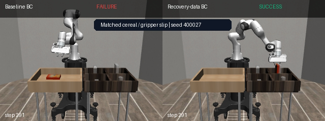
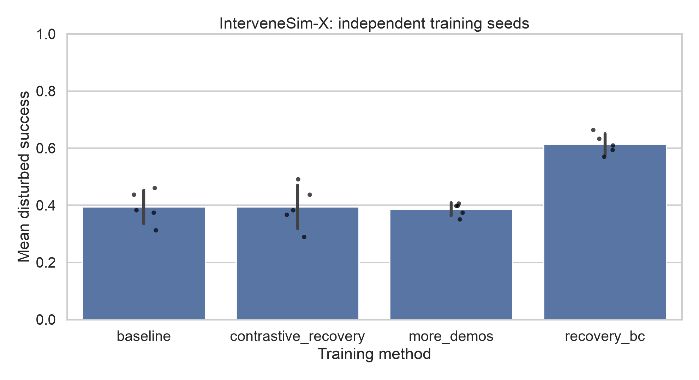

# InterveneSim-X

[](https://github.com/ethanvillalovoz/intervenesim/actions/workflows/ci.yml)
[](https://www.python.org/)
[](LICENSE)
[](docs/reproducibility.md)

**What should a robot learn from a correction?**

InterveneSim-X is a reproducible simulation study of whether corrective actions gathered
on a robot's failure distribution teach more than the same number of additional clean
demonstration labels.

> **Primary result:** recovery behavior cloning improves disturbed success from **38.6% to
> 61.4%** against an equal clean-label budget—a **+22.8 percentage-point** gain that is
> positive for all five independent policy-training seeds.

[Read the technical report](output/pdf/intervenesim-x-report.pdf) ·
[Explore the project page](docs/index.html) ·
[Inspect the frozen results](results/intervenesim-x) ·
[Read the protocol](docs/intervenesim-x.md)

[](results/intervenesim-x/intervenesim-x-cereal-slip.mp4)

The image links to a seed-matched MP4: same cereal task, same gripper slip, same evaluation
seed. The baseline fails; the recovery-trained policy reacquires and places the object.

## The study at a glance

| Dimension | Design |
|---|---|
| Robot and simulator | Panda arm, robosuite PickPlace, MuJoCo |
| Object domains | can, milk, bread, cereal |
| Deployment disturbances | object shift, action noise, action delay, gripper slip |
| Policy-training seeds | 5 independent initializations |
| Added-label budgets | 500, 1,500, 3,000, 4,800 actions |
| Primary comparison | recovery corrections vs. equal-count clean labels |
| Compute | Apple M4 Pro / MPS; CPU supported; no CUDA required |
| Cost | free software, no cloud compute, no paid APIs, no robot hardware |



| Training condition | Disturbed success | Hierarchical 95% CI |
|---|---:|---:|
| Baseline | 39.4% ± 5.8% | [33.9, 45.5] |
| + equal clean labels | 38.6% ± 2.3% | [34.5, 42.8] |
| **+ recovery labels** | **61.4% ± 3.6%** | **[56.6, 65.9]** |
| + recovery and contrastive loss | 39.4% ± 7.6% | [32.5, 46.2] |

The exact paired sign-permutation value for recovery versus clean is 0.0625. With only five
training seeds, that is the smallest attainable two-sided value for a same-direction
effect; the report emphasizes the 5/5 consistency, effect size, and interval instead of a
binary significance claim.

## Why this is more than a benchmark score

The repository implements the whole research loop:

1. Collect multi-domain clean expert demonstrations.
2. Train a task- and phase-routed behavior-cloned policy.
3. Create four controlled deployment failure families.
4. Trigger privileged expert takeover on stalled or disturbed rollouts.
5. Store both the correction and the robot action rejected at takeover.
6. Retrain clean-data and correction-data controls at identical action-label budgets.
7. Repeat across independent policy seeds and matched evaluation seeds.
8. Train and audit a causal temporal help-request model.
9. Produce episode records, uncertainty intervals, plots, a paper, and matched video.

The runner is crash-resumable: datasets, checkpoints, and completed condition evaluations
are cached independently.

## Honest negative results

### More supervision structure can hurt

The dataset makes it possible to learn not only *toward* the correction but *away* from
the action rejected by the expert. A fixed-margin contrastive objective sounds useful; it
finishes **22.0 points below** ordinary recovery behavior cloning and loses for all five
training seeds. The rejected action is contextually wrong, not necessarily globally wrong.

### Offline risk ranking is not selective intervention

The corrected temporal risk detector reaches **0.919 held-out AUROC**, but its
validation-selected high-recall threshold asks for help almost everywhere online. The
complete post-audit operating-point sweep is therefore published:

| Risk threshold | Assisted disturbed success | Disturbed episodes helped | Nominal episodes helped |
|---:|---:|---:|---:|
| 0.90 | 89.8% | 87.5% | 28.1% |
| 0.95 | 79.7% | 75.0% | 15.6% |
| **0.97** | **75.8%** | **64.8%** | **3.1%** |
| 0.99 | 54.7% | 22.7% | 0.0% |

The sweep is explicitly exploratory because it followed the deployment calibration audit.

## Quick start

Install [uv](https://docs.astral.sh/uv/), then:

```bash
git clone https://github.com/ethanvillalovoz/intervenesim.git
cd intervenesim
uv sync --locked --extra dev
uv run intervenesim doctor
uv run intervenesim smoke
```

Run the expanded benchmark:

```bash
uv run intervenesim research --config configs/research.yaml
```

Record a matched InterveneSim-X comparison from the generated checkpoints:

```bash
uv run intervenesim record-research-comparison \
  --run artifacts/runs/research-v1 \
  --output artifacts/videos/intervenesim-x.mp4 \
  --task cereal \
  --disturbance gripper_slip
```

The original single-task study remains available through `intervenesim benchmark`; its
frozen results are under [`results/benchmark-v1`](results/benchmark-v1).

## Public artifacts

- [Technical report PDF](output/pdf/intervenesim-x-report.pdf)
- [Paper source](paper/intervenesim-x.md)
- [Predeclared protocol and post-audit amendments](docs/intervenesim-x.md)
- [Reproducibility guide](docs/reproducibility.md)
- [Dataset card](docs/dataset-card.md)
- [Model card](docs/model-card.md)
- [All autonomous episode records](results/intervenesim-x/autonomous_episodes.csv)
- [All primary help-seeking episode records](results/intervenesim-x/help_episodes.csv)
- [All threshold-sweep episode records](results/intervenesim-x/help_threshold_sweep_episodes.csv)
- [Resolved experiment configuration](results/intervenesim-x/config.resolved.yaml)
- [Machine-readable manifest](results/intervenesim-x/manifest.json)

## Scope

This is a state-based simulation experiment with scripted corrections. It is not evidence
of visual robustness, human intervention quality, robot safety, or sim-to-real transfer.
After takeover, the scripted expert bypasses synthetic actuator corruption while persistent
scene changes remain. These constraints define the result rather than hiding behind it.

## Development

```bash
uv run ruff format --check .
uv run ruff check .
uv run pytest
```

InterveneSim-X is Apache-2.0 licensed. Citation metadata is in [CITATION.cff](CITATION.cff).
