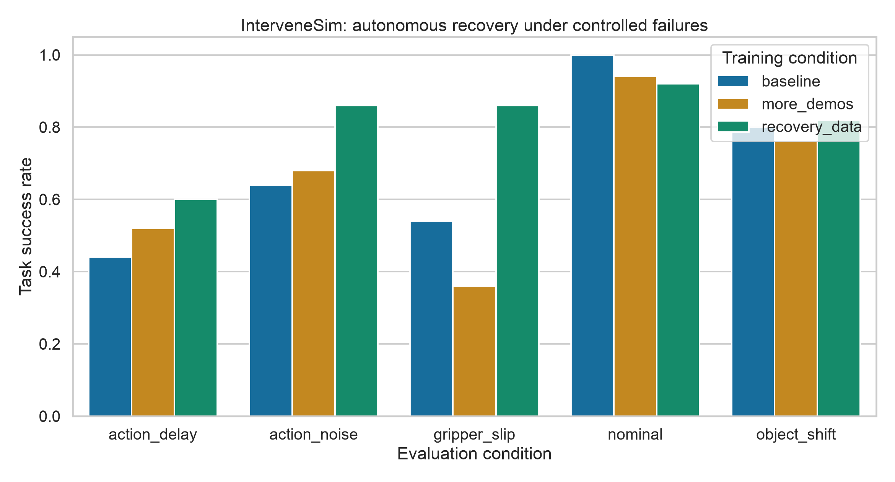
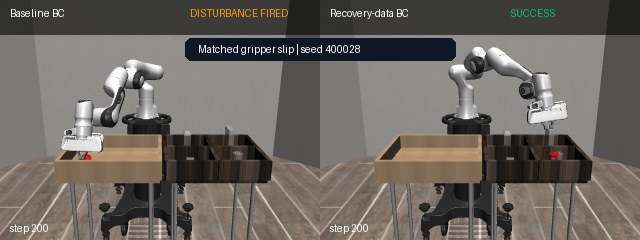
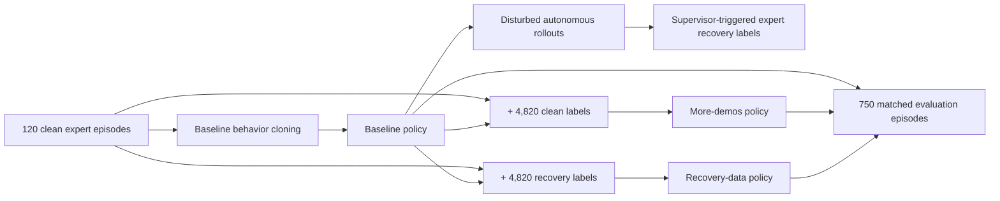

# InterveneSim

[](https://github.com/ethanvillalovoz/intervenesim/actions/workflows/ci.yml)
[](https://www.python.org/)
[](LICENSE)

InterveneSim is a simulation-only robotics benchmark for a focused question: **under the
same added-label budget, does correcting failures teach a behavior-cloned manipulation
policy more than collecting additional clean demonstrations?**

The answer in the first reproducible benchmark is yes. Across 200 disturbed,
seed-matched evaluation episodes, the recovery-data policy reaches **78.5% success**,
compared with **58.0%** for the policy given the same 4,820 extra clean labels. That is a
**+20.5 percentage-point** improvement (53 paired wins, 12 losses; two-sided exact
McNemar p=2.79×10⁻⁷).



## What the project demonstrates

- A complete robot-learning pipeline: scripted demonstrations, behavior cloning,
  controlled failures, intervention collection, matched-budget retraining, and evaluation.
- Four reproducible failure families: object displacement, control noise, action delay,
  and gripper slip.
- Honest experimental controls: identical base data, identical starting checkpoint,
  identical additional sample count, and identical evaluation seeds.
- A local-first stack that needs no robot, CUDA GPU, cloud compute, paid API, or proprietary
  simulator.

The full protocol was run on a Mac mini with an M4 Pro and 64 GB of unified memory. It
completed in about 14 minutes using PyTorch MPS. CPU execution is also supported.

## Matched recovery example

[](results/benchmark-v1/gripper-slip-comparison.mp4)

Both panels use seed `400028` and the same disturbance. The unaugmented baseline times out;
the recovery-trained policy completes the task in 159 control steps. Click the image for
the generated MP4.

## Experimental design



| Evaluation condition | Baseline | More clean demos | Recovery data |
|---|---:|---:|---:|
| Nominal | 100% | 94% | 92% |
| Object shift | 80% | 76% | 82% |
| Action noise | 64% | 68% | 86% |
| Action delay | 44% | 52% | 60% |
| Gripper slip | 54% | 36% | 86% |
| **All disturbed episodes** | **60.5%** | **58.0%** | **78.5%** |

See the [benchmark report](results/benchmark-v1/report.md), [aggregate data](results/benchmark-v1/summary.csv),
and [all 750 episode records](results/benchmark-v1/episodes.csv). The predeclared design and
interpretation boundaries are in [docs/benchmark.md](docs/benchmark.md).

## Quick start

Install [uv](https://docs.astral.sh/uv/), then run:

```bash
git clone https://github.com/ethanvillalovoz/intervenesim.git
cd intervenesim
uv sync --locked --extra dev
uv run intervenesim doctor
uv run intervenesim smoke
```

`doctor` constructs the MuJoCo task and verifies that the scripted expert can solve it.
`smoke` runs the full data-to-report pipeline with a tiny development configuration.

Run the published experiment with:

```bash
uv run intervenesim benchmark \
  --config configs/benchmark.yaml \
  --output artifacts/runs/benchmark-v1
```

Record a seed-matched baseline-failure/recovery-success episode from those results:

```bash
uv run intervenesim record-comparison \
  --run artifacts/runs/benchmark-v1 \
  --output artifacts/videos/gripper-slip-comparison.mp4 \
  --disturbance gripper_slip
```

## Implementation notes

The 24-dimensional policy observation contains end-effector position, gripper state, can
and goal positions, relative geometry, and robot joint velocity. A compact MLP predicts
Cartesian translation and gripper commands at 20 Hz. The simulator is robosuite's Panda
`PickPlaceCan` task on MuJoCo 3.3.7.

The intervention supervisor and scripted expert use privileged simulator state only while
collecting recovery labels. Learned policies receive neither the intervention flag nor the
expert's internal phase. Once the supervisor takes over, corrective commands bypass
synthetic actuator corruption; persistent physical scene changes remain. This distinction
is documented because it determines exactly what “recovery” means in this benchmark.

## Scope and limitations

This is a state-based simulation experiment, not evidence of real-world transfer, visual
robustness, or robot safety. The paired statistical test measures evaluation uncertainty
for one trained model per condition; independently retrained seeds are the most important
next experiment. Visual policies, human-provided interventions, more tasks, and sim-to-real
validation are intentionally left as extensions rather than implied claims.

## Development

```bash
uv run ruff format --check .
uv run ruff check .
uv run pytest
```

The project is Apache-2.0 licensed. If you build on it, citation metadata is available in
[CITATION.cff](CITATION.cff).
