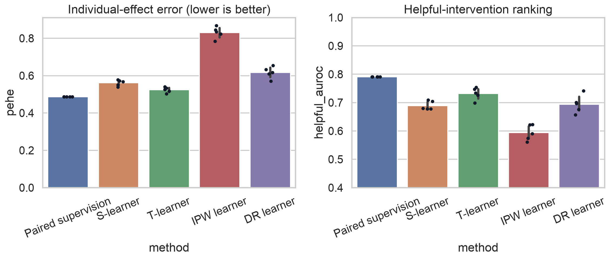
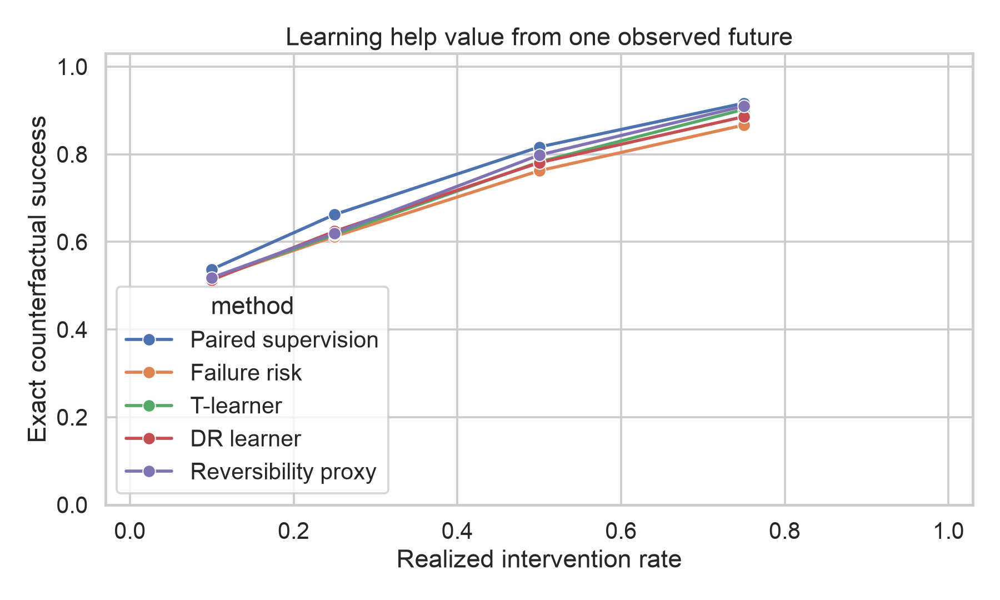
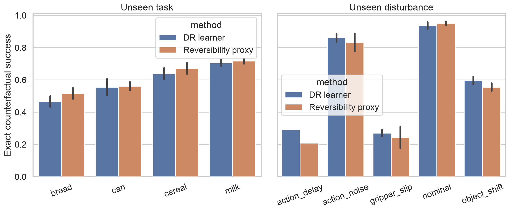
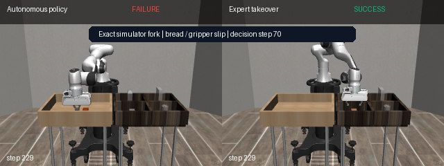

# InterveneSim-CF

[](https://github.com/ethanvillalovoz/intervenesim/actions/workflows/ci.yml)
[](https://www.python.org/)
[](LICENSE)
[](docs/reproducibility.md)
[](results/intervenesim-cf/leakage_audit.json)

**Learn when to ask for help when training reveals only one possible future.**

InterveneSim-CF is a simulation benchmark for causal robot help-seeking under selective
feedback. A deployment log contains a context, the decision to continue or request assistance,
the outcome that actually occurred, and the logging propensity. It never contains both potential
outcomes. Exact MuJoCo forks are kept behind an information boundary and revealed only to the
evaluator.

This closes the largest realism gap in InterveneSim-Value v0.3: physical systems cannot be
rewound during training to reveal what would have happened under the action not taken.

> **Primary v0.4 finding:** with one factual outcome from each of 240 training episodes, the
> T-learner reduces exact individual-effect error from **0.614 PEHE for failure risk to 0.524**
> and reaches **0.732 helpful-intervention AUROC** versus **0.706** for risk. At equal 25% and
> 50% intervention budgets, however, its success advantage over risk is only **+0.4** and
> **+2.0 points**, and it does not consistently beat a reversibility proxy. Better causal
> estimation does not automatically produce a better help policy.

[Read the v0.4 paper](output/pdf/intervenesim-cf-report.pdf) ·
[Inspect the generated report](results/intervenesim-cf/report.md) ·
[Inspect the protocol](docs/intervenesim-cf.md) ·
[Read the novelty boundary](docs/related-work.md) ·
[Inspect the factual logs](results/intervenesim-cf/logs) ·
[View the v0.3 paper](output/pdf/intervenesim-value-report.pdf)



## The single-world experiment

| Dimension | Design |
|---|---|
| Robot and simulator | Panda arm, robosuite PickPlace, MuJoCo |
| Tasks | can, milk, bread, cereal |
| Deployment conditions | nominal, object shift, action noise, action delay, gripper slip |
| Factual training data | one decision and one observed outcome from each of 240 episodes |
| Hidden evaluator | 1,517 exact paired candidates from 240 unseen-policy episodes |
| Logging policies | randomized, uncertainty-selective, online adaptive-value |
| Causal estimators | S-, T-, inverse-propensity, and cross-fitted doubly robust learners |
| Closest prior-work baseline | autonomous-failure/reversibility proxy, explicitly PAINT-inspired |
| Distribution shift | unseen policies, leave-one-task-out, leave-one-disturbance-out |
| Assistant shift | immediate, one-candidate delayed, two-candidate delayed |
| Compute | Apple M4 Pro / MPS; CPU supported; no CUDA required |
| Cost | free software, no cloud compute, no paid APIs, no robot hardware |

The training artifact has a different type from the evaluator. `LoggedBanditData` cannot
serialize `autonomous_success`, `assisted_success`, `helpful`, or `signed_value`. A machine-readable
[leakage audit](results/intervenesim-cf/leakage_audit.json) checks every frozen factual log.



| Method | PEHE ↓ | Helpful AUROC ↑ | Success @ 25% | Success @ 50% |
|---|---:|---:|---:|---:|
| Paired-label supervision† | **0.488** | **0.791** | **66.2%** | **81.7%** |
| T-learner | 0.524 | 0.732 | 61.7% | 78.2% |
| Reversibility proxy | 0.550 | 0.725 | 62.0% | 79.8% |
| Cross-fitted DR learner | 0.617 | 0.694 | 62.4% | 78.1% |
| Failure risk | 0.614 | 0.706 | 61.3% | 76.2% |

†The paired-label model sees both simulator futures and is a privileged comparator, not a
deployable single-world method. Metric values above are means over five randomized logging seeds;
fixed baselines repeat across seeds.

The primary table score-ranks episodes and gives every method the exact same intervention budget
without reading outcomes. A separate predeployment audit freezes thresholds on training contexts.
That audit finds a serious calibration failure: the DR learner's nominal 25% threshold requests
help on roughly half of unseen-policy episodes. Both views are published.

## Online, open-world, and assistant-shift audits

- **Online logging:** the adaptive logger begins randomized, refits from past factual outcomes
  every 60 episodes, and retains its exact epsilon-soft treatment propensity.
- **Sample efficiency:** learning curves expose performance at 60, 120, 180, and 240 factual
  episodes rather than only reporting the final model.
- **Open world:** every task and every disturbance is removed from training in turn. The complete
  per-group results and negative cases are retained in
  [`open_world.csv`](results/intervenesim-cf/open_world.csv).
- **Assistant latency:** the evaluator delays assistance by one or two candidate intervals along
  the exact autonomous trajectory. This tests whether a gate trained for immediate help survives
  a change in who arrives when.
- **Explicit cost:** policies are evaluated for intervention costs from 0.05 to 0.50 using
  success minus intervention cost, not only a request-count budget.



## Relationship to PAINT and interactive imitation learning

[PAINT](https://arxiv.org/abs/2210.10765) learns when an autonomous learner is approaching an
irreversible state and proactively asks for help. InterveneSim-CF estimates a different quantity:
the signed outcome change caused by a particular assistance treatment. High failure probability
does not guarantee that help can still repair the episode, and assistance can be ineffective or
harmful.

The repository also compares its scope with
[ThriftyDAgger](https://proceedings.mlr.press/v164/hoque22a.html),
[HG-DAgger](https://arxiv.org/abs/1810.02890), and
[DAgger](https://proceedings.mlr.press/v15/ross11a.html). The current contribution is the exact-fork
audit benchmark and empirical study—not a claim that the causal meta-learners themselves are new.
See [the full related-work statement](docs/related-work.md).

## Research arc

### v0.3 — learn intervention value from both futures

InterveneSim-Value snapshots the complete MuJoCo and controller state, then replays autonomous
continuation and scripted expert takeover. Its paired-label value gate reaches **0.817 AUROC** and,
near a 25% target, **66.2% success at 23.3% intervention** versus **60.4% at 24.6%** for risk.

[](results/intervenesim-value/intervenesim-value-fork.mp4)

The exploratory five-fold policy-seed audit found value above risk on all five seeds. The frozen
RGB probe transferred ranking from front-view to agent-view but not calibration, and the genuine
keyboard takeover interface remained separate from scripted data.

### v0.2 — learn recovery from correction

InterveneSim-X compares corrective recovery labels with the same number of extra clean labels.
Recovery behavior cloning improves disturbed success from **38.6% to 61.4%**, a **+22.8-point**
gain that is positive across all five training seeds.

- [v0.3 technical report](output/pdf/intervenesim-value-report.pdf)
- [v0.3 frozen results](results/intervenesim-value)
- [v0.2 technical report](output/pdf/intervenesim-x-report.pdf)
- [v0.2 frozen results](results/intervenesim-x)

## Reproduce

Install [uv](https://docs.astral.sh/uv/), then:

```bash
git clone https://github.com/ethanvillalovoz/intervenesim.git
cd intervenesim
uv sync --locked --extra dev
uv run intervenesim doctor
uv run pytest
```

Reproduce the original policies and exact-fork data, then run the single-world audit:

```bash
uv run intervenesim research --config configs/research.yaml
uv run intervenesim value-research --config configs/value.yaml
uv run intervenesim selective-research --config configs/selective.yaml
```

If the v0.3 artifacts already exist, only the final command is required. It trains small heads and
runs entirely on CPU or Apple Metal.

The development smoke test is:

```bash
uv run intervenesim selective-research \
  --config configs/selective-smoke.yaml \
  --output artifacts/runs/selective-smoke
```

## Public v0.4 artifacts

- [Research report](results/intervenesim-cf/report.md)
- [Technical report PDF](output/pdf/intervenesim-cf-report.pdf)
- [Paper source](paper/intervenesim-cf.md)
- [Study protocol and hypothesis status](docs/study-protocol-v0.4.md)
- [Method protocol](docs/intervenesim-cf.md)
- [Related work and novelty boundary](docs/related-work.md)
- [Factual-log dataset card](docs/dataset-card-cf.md)
- [Reviewer guide](docs/reviewer-guide.md)
- [Changelog](CHANGELOG.md)
- [Counterfactual metrics](results/intervenesim-cf/counterfactual_metrics.csv)
- [Equal-budget seed results](results/intervenesim-cf/gate_seed_summary.csv)
- [Training-threshold calibration audit](results/intervenesim-cf/predeployment_gate_seed_summary.csv)
- [Learning curves](results/intervenesim-cf/learning_curves.csv)
- [Open-world audit](results/intervenesim-cf/open_world.csv)
- [Assistant-latency audit](results/intervenesim-cf/latency_aggregate.csv)
- [Cost-sensitive evaluation](results/intervenesim-cf/cost_summary.csv)
- [Resolved configuration](results/intervenesim-cf/config.resolved.yaml)
- [Machine-readable manifest](results/intervenesim-cf/manifest.json)

## Scope

The exact counterfactual is valid only for this simulator, disturbance process, candidate grid,
and scripted assistant. It does not identify the value of a particular human intervention,
establish real-robot safety, or demonstrate sim-to-real transfer. The adaptive logger changes
which outcome is observed; it does not yet improve the robot control policy online. Those limits
are part of the result.

## Development

```bash
uv run ruff format --check .
uv run ruff check .
uv run pytest
```

InterveneSim-CF is Apache-2.0 licensed. Citation metadata is in [CITATION.cff](CITATION.cff).
